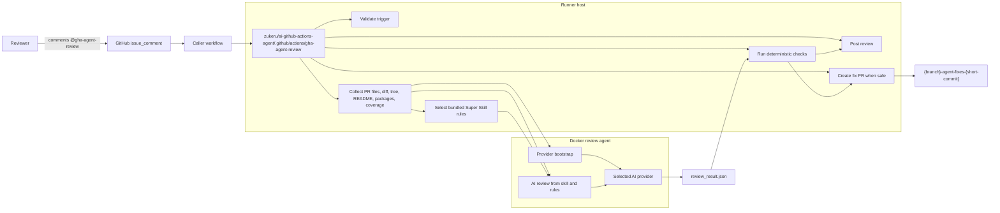
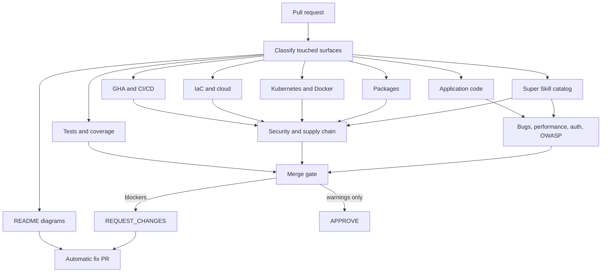
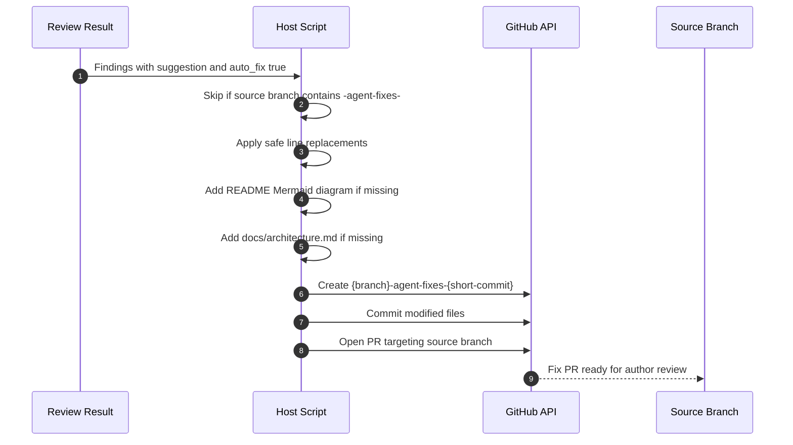

# GHA AI Agent Review

Generic automated pull request review for GitHub repositories using a composite action, a Dockerized review agent, configurable model providers, deterministic policy checks, and safe automatic fix PRs.

Created by Grant Zukel for using Claude skills in a GitHub Action.

When someone comments `@gha-agent-review` or `@gha-agent-revew` on a pull request, the workflow gathers PR context, runs an AI review against `.claude/skill.md` and `.claude/rules.md`, posts a GitHub PR review, and opens a follow-up fix PR when safe deterministic fixes are available.

## At A Glance

| Area | Behavior |
| --- | --- |
| Trigger | PR comment containing `@gha-agent-review` or `@gha-agent-revew` |
| Review model | Bedrock, Anthropic Claude, OpenAI, Azure OpenAI, or Google Gemini |
| Review rules | `.claude/skill.md` plus `.claude/rules.md`, local or remote |
| Super Skill catalog | Bundled source-pinned skill and official best-practice rule catalog, selected per PR surface |
| Review coverage | GHA, IaC, Kubernetes, Docker, JavaScript, TypeScript, React, Python, cloud patterns, compliance, security, packages, bugs, performance, tests, and coverage |
| Compliance rules | Bundled infrastructure rule catalog for GDPR, HIPAA, HITRUST CSF, ISO 27001, NIST AI RMF, NIST SP 800-53 Rev. 5, PCI DSS v4.0.1, and SOC 2 |
| Auto-fix PRs | Safe deterministic fixes create `{branch}-agent-fixes-{short-commit}` and target the reviewed source branch |
| README diagrams | Fix PRs add a Mermaid diagram when the target README has none |
| Architecture docs | Fix PRs add `docs/architecture.md` when detailed architecture documentation with Mermaid diagrams is absent |
| Coverage warning | Measurable coverage below `90%` is a non-blocking warning by default |
| Provider setup | Bedrock creates a tagged prompt marker, Azure can create/tag the account and deployment, and Google creates a Gemini File marker |
| GitHub result | `APPROVE` when no blockers remain; `REQUEST_CHANGES` and failed workflow when blocking findings exist |
| Secret isolation | GitHub token stays on the host; Docker receives only selected model provider credentials |

## Architecture



## Review Surface



## Super Skill Catalog

The action bundles a generated Super Skill catalog in `.github/actions/gha-agent-review/super_skill/`. It is built by cloning every listed public skill source, pinning the source commit, inspecting the license, extracting compatible skill guidance, and adding official best-practice rules. The generated manifest currently tracks 80 source entries across 42 distinct GitHub repositories, with license-compatible sources marked for catalog guidance and unclear-license sources retained as metadata-only attribution.

Runtime reviews do not install external skills, clone repositories, or execute third-party scripts. `collect_pr_context.py` sends only the most relevant catalog rules for the changed PR surfaces, and review findings can include `super_skill_rule_ids`, `super_skill_sources`, and `best_practice_rule_ids`. The posted review body includes Super Skill category/source coverage counts alongside one compliance table per framework.

Refresh the catalog from the repository root:

```bash
python tools/build_super_skill_catalog.py --clean-cache
```

Review `.github/actions/gha-agent-review/super_skill/source_manifest.json` after every refresh. Unknown or incompatible licenses must remain metadata-only unless the repository owner approves vendoring.

## Detailed Architecture

See [docs/architecture.md](docs/architecture.md) for a platform-architect view of the repository, including code and script responsibilities, runtime flow, provider boundaries, compliance mapping, Super Skill catalog generation, automatic fix PR orchestration, trust boundaries, and verification strategy.

## Add To Another Repo

Create `.github/workflows/gha-agent-review.yml` in the target repo:

```yaml
name: GHA AI Agent Review

on:
  issue_comment:
    types:
      - created

permissions:
  contents: write
  issues: write
  pull-requests: write

jobs:
  gha-agent-review:
    name: GHA AI Agent Review
    if: >-
      github.event.issue.pull_request &&
      (contains(github.event.comment.body, '@gha-agent-review') ||
       contains(github.event.comment.body, '@gha-agent-revew'))
    runs-on: ubuntu-latest

    steps:
      - name: "CHECKOUT:REPO"
        uses: actions/checkout@v4

      - name: "UTILITY:SETUP:PYTHON"
        uses: actions/setup-python@v5
        with:
          python-version: "3.11"

      - name: "ENV:LOAD:CONFIG"
        shell: bash
        run: |
          set -euo pipefail
          python - <<'PY'
          import json
          import os

          with open(".github/workflows/configuration/gha-agent-reviewer.json", "r", encoding="utf-8") as config_file:
              config = json.load(config_file)

          with open(os.environ["GITHUB_ENV"], "a", encoding="utf-8") as env_file:
              for key, value in config.items():
                  env_file.write(f"{key}={value}\n")
          PY

      - name: "AWS:AUTH"
        if: env.GHA_AI_AGENT_PROVIDER == 'bedrock'
        uses: aws-actions/configure-aws-credentials@v4
        with:
          aws-access-key-id: "${{ secrets.GHA_AI_AGENT_AWS_ACCESS_KEY_ID }}"
          aws-secret-access-key: "${{ secrets.GHA_AI_AGENT_AWS_SECRET_ACCESS_KEY }}"
          aws-region: "${{ env.AWS_REGION }}"

      - name: "GHA_AI_AGENT:REVIEW"
        uses: zukeru/ai-github-actions-agent/.github/actions/gha-agent-review@main
        with:
          github-token: "${{ secrets.GHA_AI_AGENT_GIT_TOKEN }}"
          pr-number: "${{ github.event.issue.number }}"
          repository: "${{ github.repository }}"
          aws-region: "${{ env.AWS_REGION }}"
          provider: "${{ env.GHA_AI_AGENT_PROVIDER }}"
          model-id: "${{ env.GHA_AI_AGENT_MODEL_ID }}"
          anthropic-api-key: "${{ secrets.GHA_AI_AGENT_ANTHROPIC_API_KEY }}"
          claude-api-key: "${{ secrets.GHA_AI_AGENT_CLAUDE_API_KEY }}"
          openai-api-key: "${{ secrets.GHA_AI_AGENT_OPENAI_API_KEY }}"
          azure-openai-api-key: "${{ secrets.GHA_AI_AGENT_AZURE_OPENAI_API_KEY }}"
          azure-openai-endpoint: "${{ secrets.GHA_AI_AGENT_AZURE_OPENAI_ENDPOINT }}"
          azure-openai-api-version: "${{ env.GHA_AI_AGENT_AZURE_OPENAI_API_VERSION }}"
          azure-access-token: "${{ secrets.GHA_AI_AGENT_AZURE_ACCESS_TOKEN }}"
          azure-subscription-id: "${{ env.GHA_AI_AGENT_AZURE_SUBSCRIPTION_ID }}"
          azure-resource-group: "${{ env.GHA_AI_AGENT_AZURE_RESOURCE_GROUP }}"
          azure-openai-account-name: "${{ env.GHA_AI_AGENT_AZURE_OPENAI_ACCOUNT_NAME }}"
          azure-openai-location: "${{ env.GHA_AI_AGENT_AZURE_OPENAI_LOCATION }}"
          azure-openai-account-sku: "${{ env.GHA_AI_AGENT_AZURE_OPENAI_ACCOUNT_SKU }}"
          azure-openai-deployment-model-name: "${{ env.GHA_AI_AGENT_AZURE_OPENAI_DEPLOYMENT_MODEL_NAME }}"
          azure-openai-deployment-model-version: "${{ env.GHA_AI_AGENT_AZURE_OPENAI_DEPLOYMENT_MODEL_VERSION }}"
          azure-openai-deployment-sku-name: "${{ env.GHA_AI_AGENT_AZURE_OPENAI_DEPLOYMENT_SKU_NAME }}"
          azure-openai-deployment-capacity: "${{ env.GHA_AI_AGENT_AZURE_OPENAI_DEPLOYMENT_CAPACITY }}"
          google-api-key: "${{ secrets.GHA_AI_AGENT_GOOGLE_API_KEY }}"
          skill-file: "https://github.com/zukeru/ai-github-actions-agent/blob/main/.claude/skill.md"
          rules-file: "https://github.com/zukeru/ai-github-actions-agent/blob/main/.claude/rules.md"
          auto-fix-enabled: "true"
          coverage-warning-threshold: "90"
          add-readme-diagrams: "true"
          add-architecture-docs: "true"
          super-skill-enabled: "true"
          super-skill-max-rules: "120"
```

Add `.github/workflows/configuration/gha-agent-reviewer.json`:

```json
{
  "AWS_REGION": "us-east-1",
  "GHA_AI_AGENT_PROVIDER": "bedrock",
  "GHA_AI_AGENT_MODEL_ID": "us.anthropic.claude-sonnet-4-6",
  "GHA_AI_AGENT_AZURE_OPENAI_API_VERSION": "2024-10-21",
  "GHA_AI_AGENT_AZURE_SUBSCRIPTION_ID": "",
  "GHA_AI_AGENT_AZURE_RESOURCE_GROUP": "",
  "GHA_AI_AGENT_AZURE_OPENAI_ACCOUNT_NAME": "",
  "GHA_AI_AGENT_AZURE_OPENAI_LOCATION": "",
  "GHA_AI_AGENT_AZURE_OPENAI_ACCOUNT_SKU": "S0",
  "GHA_AI_AGENT_AZURE_OPENAI_DEPLOYMENT_MODEL_NAME": "",
  "GHA_AI_AGENT_AZURE_OPENAI_DEPLOYMENT_MODEL_VERSION": "",
  "GHA_AI_AGENT_AZURE_OPENAI_DEPLOYMENT_SKU_NAME": "Standard",
  "GHA_AI_AGENT_AZURE_OPENAI_DEPLOYMENT_CAPACITY": "1",
  "DEBUG": "false"
}
```

Then comment on a PR:

```text
@gha-agent-review
```

## Composite Action Inputs

| Input | Required | Default | Description |
| --- | --- | --- | --- |
| `github-token` | Yes | | Token used by host-side scripts to read PR context, post reviews, and open fix PRs |
| `pr-number` | Yes | | Pull request number |
| `repository` | Yes | | Repository in `owner/name` format |
| `provider` | No | `auto` | Model provider: `auto`, `bedrock`, `anthropic`, `openai`, `azure-openai`, or `google` |
| `model-id` | No | | Model ID, Bedrock inference profile ID, or Azure OpenAI deployment name |
| `aws-region` | No | | AWS region used for Bedrock |
| `anthropic-api-key` / `claude-api-key` | No | | Anthropic Claude provider keys |
| `openai-api-key` | No | | OpenAI provider key |
| `azure-openai-api-key` / `azure-openai-endpoint` | No | | Azure OpenAI data-plane values |
| `azure-access-token` | No | | Azure Resource Manager token for create/tag setup |
| `azure-subscription-id` / `azure-resource-group` | No | | Azure setup scope |
| `azure-openai-account-name` / `azure-openai-location` | No | | Azure OpenAI account to create or tag |
| `azure-openai-account-sku` | No | `S0` | Azure OpenAI account SKU |
| `azure-openai-deployment-model-name` / `azure-openai-deployment-model-version` | No | | Base model used when creating an Azure deployment |
| `azure-openai-deployment-sku-name` | No | `Standard` | Azure deployment SKU |
| `azure-openai-deployment-capacity` | No | `1` | Azure deployment capacity |
| `google-api-key` | No | | Google Gemini provider key |
| `skill-file` | No | `.claude/skill.md` | Local path or URL for the review skill |
| `rules-file` | No | `.claude/rules.md` | Local path or URL for review rules |
| `trigger-phrases` | No | `@gha-agent-review,@gha-agent-revew` | Comma-separated trigger phrases |
| `bedrock-prompt-name` | No | `gha-agent-review` | Provider setup marker name |
| `max-inline-comments` | No | `25` | Inline review comment cap |
| `auto-fix-enabled` | No | `true` | Open fix PRs for safe deterministic fixes |
| `coverage-warning-threshold` | No | `90` | Coverage warning threshold |
| `add-readme-diagrams` | No | `true` | Add Mermaid README diagrams in fix PRs when absent |
| `add-architecture-docs` | No | `true` | Add `docs/architecture.md` in fix PRs when architecture documentation with Mermaid diagrams is absent |
| `super-skill-enabled` | No | `true` | Include the bundled Super Skill catalog in AI review context |
| `super-skill-max-rules` | No | `120` | Maximum relevant Super Skill rules selected for one PR review |
| `auto-fix-max-findings` | No | `25` | Maximum safe finding fixes per fix PR |
| `auto-fix-max-files` | No | `10` | Maximum files changed by safe finding fixes |
| `debug` | No | `false` | Reserved for verbose workflow behavior |

## Outputs

| Output | Description |
| --- | --- |
| `finding-count` | Number of review findings |
| `blocking-finding-count` | Number of findings that block merge |
| `warning-count` | Number of non-blocking warnings |
| `fixed-count` | Number of tracked blockers no longer present |
| `requested-count` | Number of unique tracked blockers across review runs |
| `review-state` | Submitted GitHub review state |
| `fix-pr-url` | Automatic fix PR URL, when one was created |
| `fix-branch` | Automatic fix branch, when one was created |
| `auto-fix-count` | Number of safe finding fixes applied |
| `diagram-added` | Whether a README Mermaid diagram was added |
| `architecture-doc-added` | Whether architecture documentation was added |
| `bedrock-setup-status` | Provider setup status: `found`, `created`, `updated`, or `preflighted` |
| `provider-name` | Selected provider after `auto` resolution |

## Provider Configuration

Set `provider` explicitly when more than one provider secret is available. With `provider: auto`, the action picks the first complete configuration in this order: Azure OpenAI, Anthropic, OpenAI, Google, then Bedrock. Azure OpenAI counts as complete when either the data-plane key and endpoint are present or the Azure Resource Manager setup values are present.

Direct API providers run inside the Docker review agent. Bedrock runs the prompt-marker bootstrap so the AWS account has a traceable setup marker. Azure setup uses Azure Resource Manager to create or tag the Azure OpenAI account and deployment with `purpose=gha-agent-review` when management values are configured. Google setup creates or reuses a Gemini File marker named `gha-agent-review`; the Gemini API does not expose tag fields on that resource, so the file marker provides traceability.

## Automatic Fix PR Behavior



Automatic fixes are intentionally conservative. The action applies only findings marked `auto_fix: true` with exact line replacements, adds README diagrams when enabled, and adds `docs/architecture.md` when architecture documentation is absent. If GitHub token permissions do not allow branch creation or PR creation, the review still posts and includes the failure reason.

## Architecture Documentation Requirement

GHA AI Agent expects repositories to keep architecture documentation visible for reviewers. A repo should include `docs/architecture.md`, `ARCHITECTURE.md`, `docs/platform-architecture.md`, or an equivalent Markdown design document with at least one Mermaid diagram. The document should explain the system purpose, repository map, runtime flow, trust boundaries, CI/CD scripts, provider or infrastructure dependencies, and security/compliance responsibilities.

If architecture documentation is missing, deterministic policy checks add a non-blocking `documentation.architecture.missing` warning. If architecture docs exist but have no Mermaid diagram in captured context, the action adds a `documentation.architecture.mermaid` warning. When `add-architecture-docs` is enabled, the automatic fix PR creates a baseline `docs/architecture.md` from the repository tree.

## Compliance Framework Counts

The action vendors a normalized infrastructure compliance catalog at `.github/actions/gha-agent-review/compliance/infrastructure_compliance_catalog.json`. It was generated from the provided framework JSON files and keeps the framework key, framework name, total rule count, rule IDs, rule titles, source file names, and matching keywords.

Every review prompt includes relevant catalog matches for:

| Framework | Key |
| --- | --- |
| GDPR | `gdpr` |
| HIPAA | `hipaa` |
| HITRUST CSF | `hitrust` |
| ISO 27001 | `iso27001` |
| NIST AI RMF | `nist_ai_rmf` |
| NIST SP 800-53 Rev. 5 | `nist_sp80053r5` |
| PCI DSS v4.0.1 | `pci_dss_v4_0_1` |
| SOC 2 | `soc2` |

Findings can include `compliance_frameworks` and `compliance_rule_ids`. The host review step also maps findings back to the catalog when the model omits those fields. The PR review body renders one table per framework with loaded rule count, violating finding count, distinct violated rule count, blocker count, warning count, severity counts, and matched rule IDs.

Required workflow permissions for review plus fix PRs:

```yaml
permissions:
  contents: write
  issues: write
  pull-requests: write
```

## Source-Backed Rule Baseline

The bundled rules were built from primary or official sources:

- [GitHub Actions secure use](https://docs.github.com/en/actions/reference/security/secure-use)
- [GitHub Actions OIDC](https://docs.github.com/en/actions/concepts/security/openid-connect)
- [OWASP Top 10](https://owasp.org/Top10/)
- [OWASP Code Review Guide](https://owasp.org/www-project-code-review-guide/)
- [OWASP ASVS](https://owasp.org/www-project-application-security-verification-standard/)
- [Kubernetes Pod Security Standards](https://kubernetes.io/docs/concepts/security/pod-security-standards/)
- [Kubernetes Security Checklist](https://kubernetes.io/docs/concepts/security/security-checklist/)
- [Docker build best practices](https://docs.docker.com/build/building/best-practices/)
- [AWS Well-Architected Security Pillar](https://docs.aws.amazon.com/wellarchitected/latest/security-pillar/welcome.html)
- [CloudFormation best practices](https://docs.aws.amazon.com/AWSCloudFormation/latest/UserGuide/best-practices.html)
- [Azure Well-Architected Security](https://learn.microsoft.com/en-us/azure/well-architected/security/)
- [Google Cloud Architecture Framework security](https://docs.cloud.google.com/architecture/framework/security)
- [Terraform style guide](https://developer.hashicorp.com/terraform/language/style)
- [Pulumi secrets](https://www.pulumi.com/docs/iac/concepts/secrets/)
- [NIST SSDF](https://csrc.nist.gov/pubs/sp/800/218/final)
- [CIS Controls v8](https://www.cisecurity.org/controls/v8)
- [SLSA v1.0](https://slsa.dev/spec/v1.0/)
- [OpenSSF Scorecard](https://github.com/ossf/scorecard)
- [npm audit](https://docs.npmjs.com/cli/v10/commands/npm-audit/)
- [TypeScript TSConfig](https://www.typescriptlang.org/tsconfig/)
- [React dangerous HTML docs](https://react.dev/reference/react-dom/components/common#dangerously-setting-the-inner-html)
- [Python secrets](https://docs.python.org/3/library/secrets.html)
- [Python subprocess security](https://docs.python.org/3/library/subprocess.html#security-considerations)
- [Jest coverageThreshold](https://jestjs.io/docs/configuration#coveragethreshold-object)
- [Vitest coverage](https://vitest.dev/config/)
- [coverage.py fail_under](https://coverage.readthedocs.io/en/latest/config.html)

Marketplace skill research was also downloaded during implementation for security best practices, threat modeling, GitHub CI repair, GitHub review comments, OpenAI docs, and GitHub publish workflows. The relevant guidance was merged into `.claude/skill.md`; the action does not require those skills to be installed at runtime.

## Local Development

```bash
cp .env.example .env
python -m unittest discover -s tests -v
python - <<'PY'
import pathlib
import py_compile

for path in pathlib.Path(".github/actions/gha-agent-review").rglob("*.py"):
    py_compile.compile(str(path), doraise=True)
PY
git diff --check
```

Optional workflow lint:

```bash
go install github.com/rhysd/actionlint/cmd/actionlint@latest
$(go env GOPATH)/bin/actionlint .github/workflows/gha-agent-review.yml
```

Optional Docker build:

```bash
docker build -t gha-agent-review-agent:local-test .github/actions/gha-agent-review/docker
```

## Troubleshooting

| Symptom | Likely Cause | Fix |
| --- | --- | --- |
| Workflow does not start | Comment was not on a PR or did not include the trigger phrase | Comment `@gha-agent-review` on the PR conversation |
| Provider preflight fails | Missing or invalid model provider credentials | Check `provider`, `model-id`, and matching provider secret values |
| Fix PR is not created | No safe deterministic fixes, branch already is an agent fix branch, or token cannot push/open PR | Review the Automatic Fix PR section in the review body |
| Inline comments are missing | Findings did not map to changed lines or exceeded the cap | Review the summary section or increase `max-inline-comments` |
| Docker step fails | Docker daemon unavailable on runner | Use a runner with Docker available |

## Current Validation

The repository includes tests for trigger parsing, diff mapping, review normalization, posting behavior, generic deterministic policy checks, coverage warnings, README diagram detection, automatic fix branch naming, safe fix application, and fix PR creation payloads.
