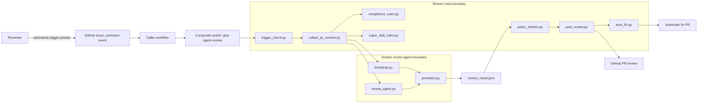
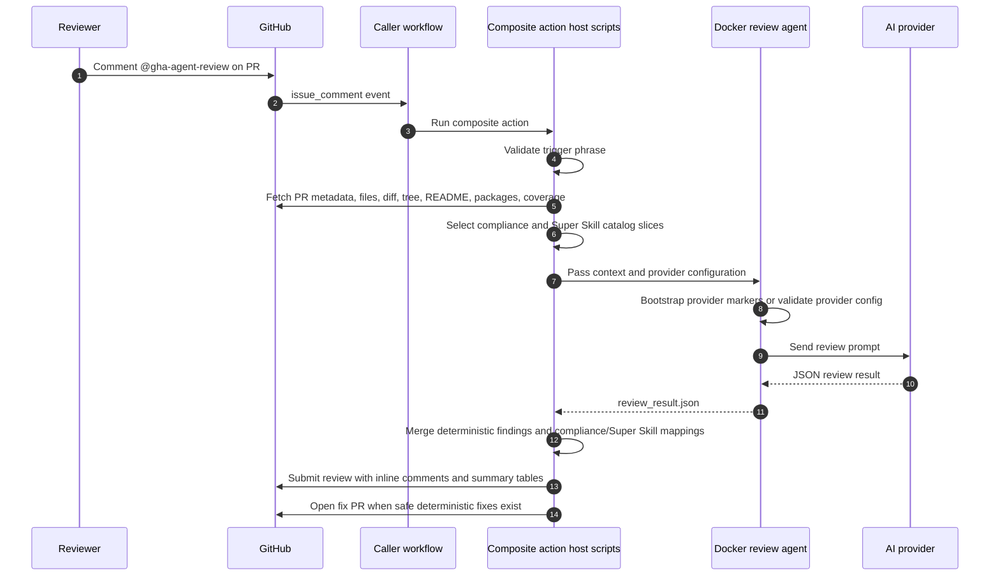
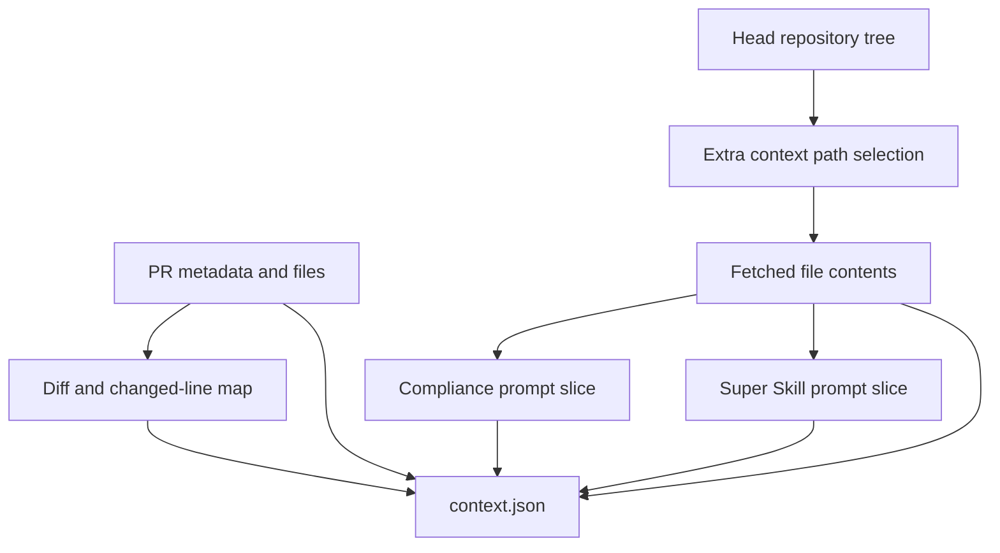
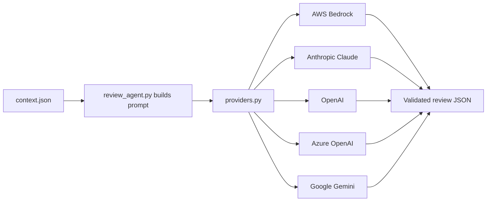
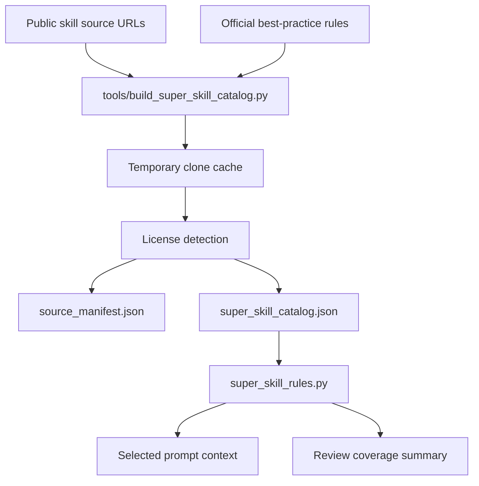
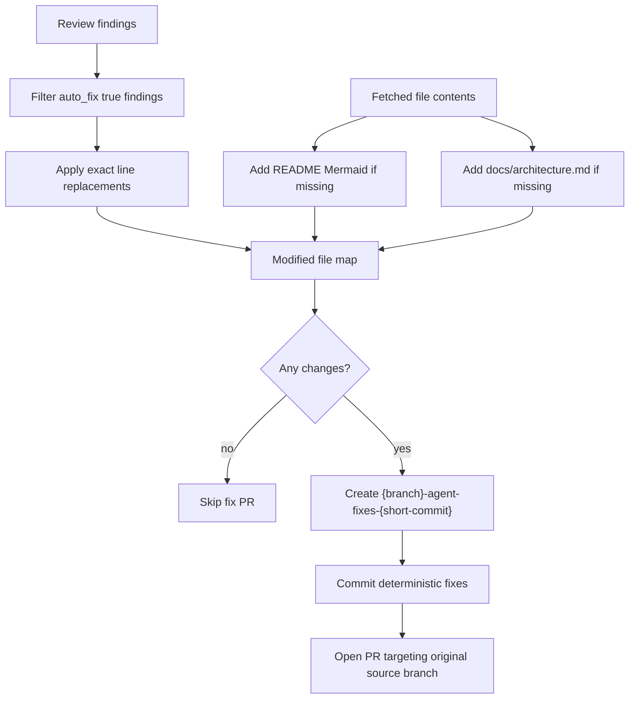
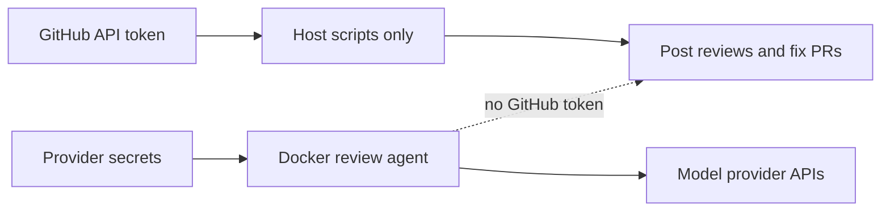

# GHA AI Agent Review Architecture

Created by Grant Zukel for using Claude skills in a GitHub Action.

This document explains how the repository works from a platform architecture point of view. It covers the composite action, Docker review agent, provider bootstrap, deterministic policy checks, Super Skill catalog, compliance catalog, automatic fix PR flow, and test strategy.

## System Purpose

GHA AI Agent Review is a reusable GitHub Action that reviews pull requests when a reviewer comments `@gha-agent-review` or `@gha-agent-revew`. It combines deterministic static checks with an AI model review. The action can post inline PR findings, summarize compliance and Super Skill coverage, and open a follow-up PR with safe deterministic fixes.

The design goals are:

- Keep the GitHub token on the runner host and out of the model container.
- Support multiple model providers without changing caller workflows.
- Keep review rules self-contained in the repository.
- Use deterministic checks for high-confidence policy problems.
- Let AI review handle contextual code quality, security, compliance, and bug analysis.
- Create fix PRs only for safe, bounded changes.

## Repository Map

```text
.
|-- .claude/
|   |-- rules.md
|   `-- skill.md
|-- .github/
|   |-- actions/gha-agent-review/
|   |   |-- action.yml
|   |   |-- compliance/infrastructure_compliance_catalog.json
|   |   |-- docker/
|   |   |   |-- Dockerfile
|   |   |   `-- gha_agent_review_agent/
|   |   |       |-- bootstrap.py
|   |   |       |-- providers.py
|   |   |       `-- review_agent.py
|   |   |-- scripts/
|   |   |   |-- auto_fix.py
|   |   |   |-- collect_pr_context.py
|   |   |   |-- compliance_rules.py
|   |   |   |-- policy_checks.py
|   |   |   |-- post_review.py
|   |   |   |-- review_common.py
|   |   |   |-- super_skill_rules.py
|   |   |   `-- trigger_check.py
|   |   `-- super_skill/
|   |       |-- SETUP_SKILL.md
|   |       |-- source_manifest.json
|   |       `-- super_skill_catalog.json
|   `-- workflows/
|-- docs/
|   `-- architecture.md
|-- tests/
|-- tools/
|   |-- build_compliance_catalog.py
|   `-- build_super_skill_catalog.py
`-- README.md
```

## High-Level Architecture



The host boundary owns GitHub API operations that require repository write privileges. The Docker boundary owns provider setup and model invocation. This split is intentional: model provider credentials can enter the container, but the GitHub token used for comments, reviews, branches, and PRs stays on the host.

## Execution Flow



## Composite Action

The composite action lives at `.github/actions/gha-agent-review/action.yml`. It is the public interface for caller repositories.

Key responsibilities:

- Define action inputs and outputs.
- Validate the comment trigger.
- Collect PR context through GitHub APIs.
- Build the Docker image for the review agent.
- Bootstrap the selected provider.
- Run the AI review.
- Post GitHub review output.
- Open a fix PR when safe fixes are available.

Important inputs include:

| Input | Purpose |
| --- | --- |
| `github-token` | Host-side GitHub API token for PR review and fix PR creation |
| `provider` | `auto`, `bedrock`, `anthropic`, `openai`, `azure-openai`, or `google` |
| `model-id` | Provider model ID, Bedrock inference profile, or Azure deployment |
| `skill-file` | Local or remote `.claude/skill.md` source |
| `rules-file` | Local or remote `.claude/rules.md` source |
| `auto-fix-enabled` | Enables safe automatic fix PRs |
| `add-readme-diagrams` | Adds Mermaid README diagrams when absent |
| `add-architecture-docs` | Adds `docs/architecture.md` when detailed architecture docs are absent |
| `super-skill-enabled` | Includes the bundled Super Skill catalog in the review prompt |
| `coverage-warning-threshold` | Default coverage warning threshold, currently `90` |

## Context Collection

`collect_pr_context.py` builds the review payload. It fetches:

- PR title, body, base branch, head branch, and head SHA.
- Changed files and patches.
- Recursive head tree paths.
- Selected file contents for text files, package metadata, workflows, coverage reports, README files, and common config files.
- Local or remote skill and rules files.
- Relevant compliance rules from the bundled compliance catalog.
- Relevant Super Skill rules from the bundled Super Skill catalog.



Changed-line maps are important because inline GitHub comments must target lines in the PR diff. The context collector keeps enough source text to allow `post_review.py` to decide whether a finding can become an inline comment or must be summarized in the review body.

## AI Review Agent

The Docker review agent is under `.github/actions/gha-agent-review/docker/gha_agent_review_agent/`.

`bootstrap.py` prepares provider-specific state:

- Bedrock creates or updates a prompt marker.
- Azure OpenAI can create or tag the account and deployment through Azure Resource Manager.
- Google Gemini creates or reuses a Gemini File marker.
- Direct API providers are preflighted.

`providers.py` resolves `provider: auto` and invokes the provider API.

`review_agent.py` builds the review prompt, sends it to the provider, extracts JSON, and validates the model result. The result contract is intentionally narrow so downstream host scripts can reliably post reviews and create safe fix PRs.



## Deterministic Policy Checks

`policy_checks.py` provides fast, repeatable checks that do not require model judgment. These checks are merged into the AI result before posting.

Coverage includes:

- GitHub Actions token, runner, permission, action-ref, remote-script, Docker socket, and OIDC risk.
- Hardcoded credential patterns.
- Dockerfile base image, root user, remote ADD, and remote script execution risk.
- Kubernetes privileged, root, host access, and mutable image risk.
- IaC public management ingress, wildcard IAM, and public access risk.
- Package manifest and lockfile drift.
- Coverage below the configured threshold.
- README Mermaid diagrams.
- Architecture documentation with Mermaid diagrams.

Deterministic findings use the same result shape as model findings. Where safe, they include exact `suggestion` text and `auto_fix: true`.

## Compliance Catalog

The compliance catalog is generated by `tools/build_compliance_catalog.py` and consumed by `compliance_rules.py`.

Supported bundled framework keys:

| Framework | Key |
| --- | --- |
| GDPR | `gdpr` |
| HIPAA | `hipaa` |
| HITRUST CSF | `hitrust` |
| ISO 27001 | `iso27001` |
| NIST AI RMF | `nist_ai_rmf` |
| NIST SP 800-53 Rev. 5 | `nist_sp80053r5` |
| PCI DSS v4.0.1 | `pci_dss_v4_0_1` |
| SOC 2 | `soc2` |

Compliance mapping happens in two places:

1. `collect_pr_context.py` sends matching catalog rule hints to the model.
2. `post_review.py` calls `apply_compliance_mapping()` to map final findings to framework counts.

The review body renders one table per framework with loaded rule count, violating findings, blocking findings, warnings, severity counts, and distinct rule IDs.

## Super Skill Catalog

The Super Skill catalog lives under `.github/actions/gha-agent-review/super_skill/`.



The builder clones every configured source, pins the commit, inspects licenses, and extracts only compatible guidance. Unknown or incompatible license sources remain metadata-only. Runtime reviews use the generated JSON files only; they do not clone external repos, install skills, or execute downloaded scripts.

The catalog contributes:

- Engineering workflow guidance.
- Source-driven development and planning guidance.
- TDD and diagnosis guidance.
- Security, code-quality, performance, accessibility, and testing guidance.
- Framework and provider guidance for React, Next.js, Terraform, cloud platforms, data systems, authentication, and MCP surfaces.
- Official best-practice rules for GitHub Actions, OWASP, Kubernetes, Docker, AWS, Azure, Google Cloud, NIST SSDF, OpenSSF Scorecard, SLSA, Terraform, TypeScript, React, and Python.

## Review Posting

`post_review.py` is the host-side orchestrator after model review completes.

It performs these steps:

1. Load `context.json` and `review_result.json`.
2. Run deterministic policy checks.
3. Normalize result shape.
4. Add changed source lines for inline comments.
5. Apply compliance mapping.
6. Apply Super Skill mapping.
7. Run automatic fix PR orchestration.
8. Split findings into inline and summary findings.
9. Submit a GitHub review.
10. Emit action outputs.

`review_common.py` owns shared formatting, severity handling, finding fingerprints, history markers, inline comment body formatting, compliance tables, and Super Skill tables.

## Automatic Fix PR Flow

`auto_fix.py` creates fix PRs from the reviewed source branch. It deliberately avoids broad or uncertain changes.



The fix branch always starts from the PR head SHA and targets the original PR branch. If the source branch already contains `-agent-fixes-`, automatic fix creation is skipped to avoid loops.

Safe automatic fixes include:

- Exact line replacements from deterministic or model findings.
- README Mermaid diagram insertion when absent.
- `docs/architecture.md` creation when architecture docs are absent.

Unsafe fixes remain review comments. Examples include package major upgrades, auth redesigns, broad refactors, migrations, and changes that require product decisions.

## Documentation Rule

The agent requires visible repository documentation for architecture and workflows. A repository should include a Markdown architecture document such as `docs/architecture.md`, `ARCHITECTURE.md`, or a similar architecture/design document.

Minimum expected content:

- System purpose and repository map.
- Runtime flow.
- Trust boundaries.
- Scripts and operational entry points.
- Provider or infrastructure dependencies.
- Security and compliance considerations.
- At least one Mermaid diagram.

If the documentation does not exist, the agent reports a non-blocking documentation warning and can open a fix PR that adds `docs/architecture.md`.

## Security Boundaries



The most important boundary is credential separation. Host scripts use the GitHub token. The Docker container receives model provider credentials, but not the host GitHub token. This reduces the blast radius of prompt injection and model-provider execution paths.

Additional safeguards:

- Automatic fixes use bounded file maps, not shell mutations.
- Fix PRs are skipped for existing agent fix branches.
- Unknown-license skill content is metadata-only.
- Third-party skill scripts are not executed at runtime.
- Compliance and Super Skill catalogs are bundled and source-attributed.

## Testing Strategy

Tests are standard Python `unittest` files under `tests/`.

Major coverage areas:

- Trigger parsing.
- Diff and changed-line mapping.
- PR context collection helpers.
- Provider resolution and invocation payloads.
- Provider bootstrap for Bedrock, Azure, and Google.
- Deterministic policy checks.
- Compliance catalog mapping and summary tables.
- Super Skill catalog generation, slicing, mapping, and summary tables.
- Automatic fix branch naming, skip behavior, line replacement, README diagrams, architecture docs, and PR payloads.
- GitHub review posting behavior and fallback paths.
- Forbidden legacy term sweep.

Run verification:

```bash
python -m unittest discover -s tests -v
python -m py_compile $(git ls-files "*.py")
git diff --check
```

On Windows PowerShell, the compile command used in this repo is:

```powershell
$files = rg --files -g '*.py'; python -m py_compile @files
```

## Operational Notes

- Use `zukeru/ai-github-actions-agent/.github/actions/gha-agent-review@main` in caller workflows.
- Grant the token `contents: write` and `pull-requests: write` if automatic fix PRs should be created.
- Keep `provider` explicit when more than one provider secret is configured.
- Keep the generated compliance and Super Skill catalogs checked in so runtime review does not depend on external network access beyond GitHub PR APIs and the selected model provider.
- Regenerate catalogs intentionally and review the resulting diff before publishing.

